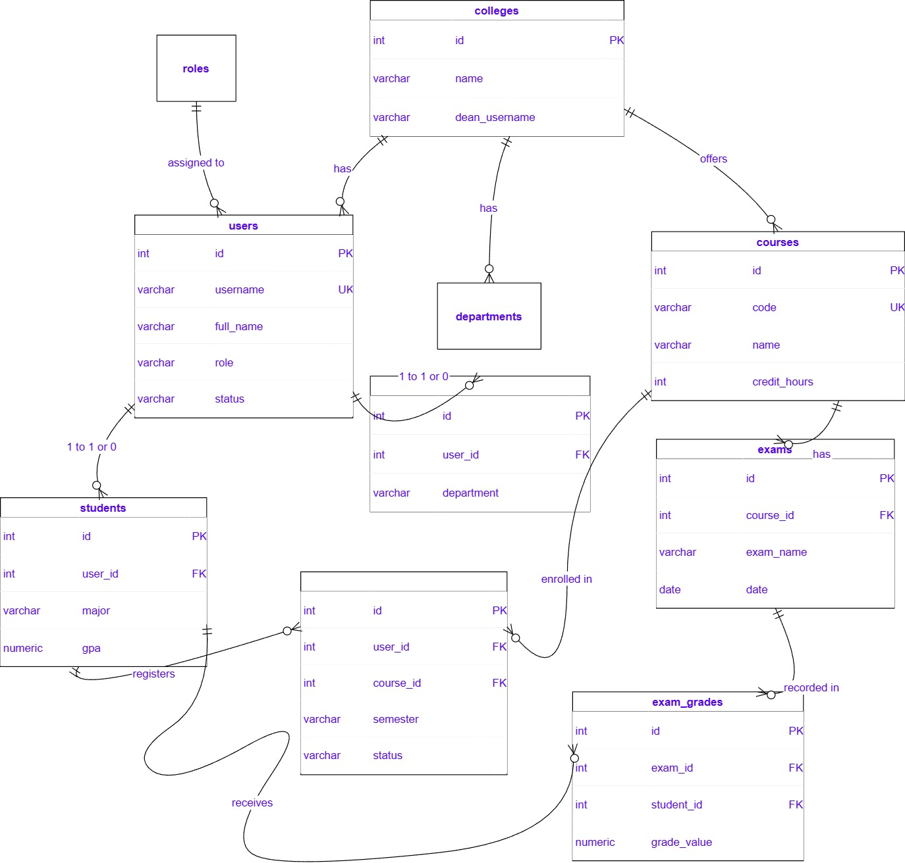
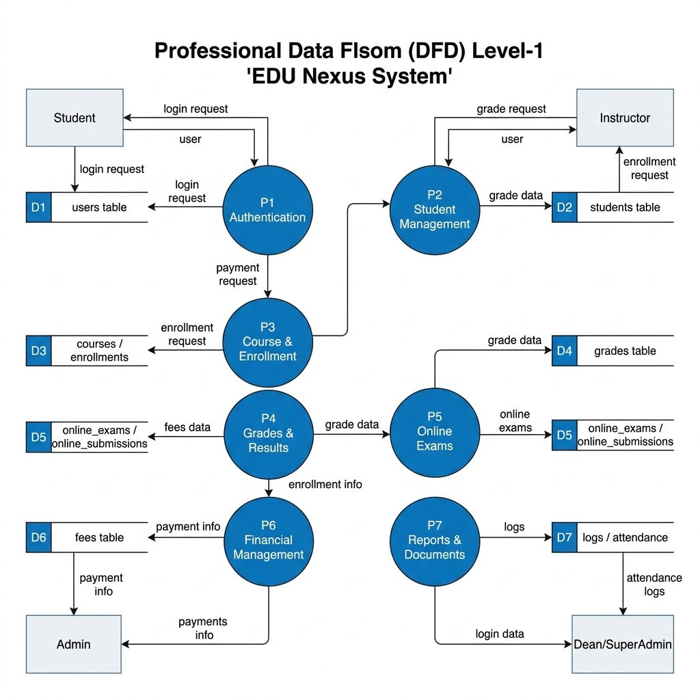
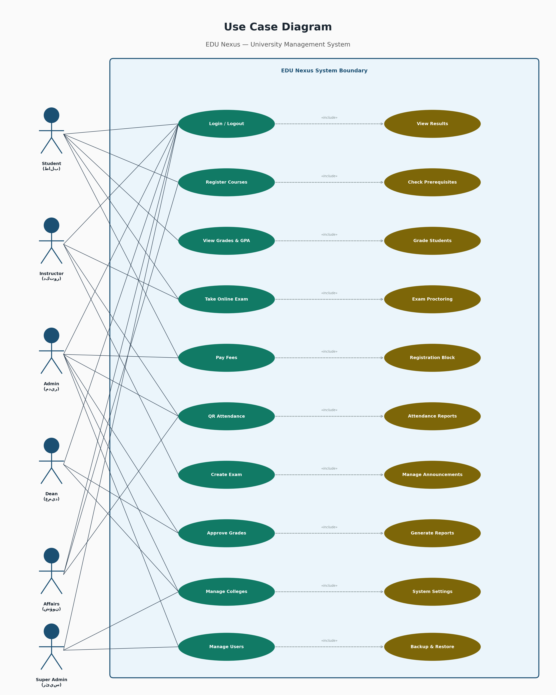
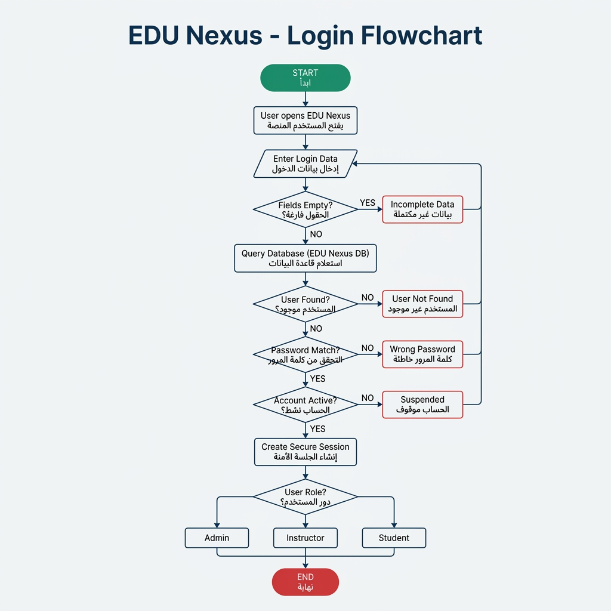

# EDU Nexus — University Management System

EDU Nexus is a comprehensive Learning Management System (LMS) and University Information System designed to streamline academic operations. It provides role-based access for Students, Instructors, Administrators, College Deans, and a Super Admin, ensuring a cohesive ecosystem for managing educational activities.

## 🌟 Key Features

- **Online Exams & Auto-Grading**: Secure online examination system with automatic grading and instant results.
- **QR Code Attendance**: Seamless attendance tracking using dynamically generated QR codes for lectures.
- **Course Registration & Scheduling**: Intuitive portals for students to register for courses and view their academic schedules.
- **Fee Payment Portal**: Integrated financial management for student tuition and fee tracking.
- **Library Management**: Digital catalog for searching, borrowing, and managing academic resources and books.
- **Internal Messaging & Announcements**: Built-in communication tools for university-wide announcements and direct messaging between staff and students.

## 🛠 Tech Stack

- **Backend**: PHP (Native OOP)
- **Database**: PostgreSQL
- **Frontend**: HTML5, JavaScript, Tailwind CSS
- **Authentication**: Session-based Role Authorization

## 🔒 Security Highlights

- **SQL Injection Prevention**: All database interactions use **PDO Prepared Statements**.
- **Password Security**: Passwords are securely hashed using **BCrypt** (`password_hash` & `password_verify`).
- **Access Control**: Strict Session-based Role Authorization to prevent unauthorized access.
- **IDOR Protection**: Safeguards against Insecure Direct Object Reference vulnerabilities in critical actions.

## 📊 System Diagrams

*(Note: Diagrams are located in the `/docs/diagrams/` folder)*

### Entity-Relationship Diagram (ERD) / Database Schema


### Context-Level Data Flow Diagram (DFD)


### Use Case Diagram


### Login Flowchart


## 🚀 Setup & Installation

### Requirements
- PHP 8.1 or higher
- PostgreSQL 13 or higher
- A web server (Apache/Nginx) or PHP's built-in server

### Installation Steps

1. **Clone the repository:**
   ```bash
   git clone https://github.com/your-username/EDU-Nexus.git
   cd EDU-Nexus
   ```

2. **Database Setup:**
   - Create a new PostgreSQL database named `edu_nexus`.
   - Import the database schema and seed data (you can use `pg_restore` or execute the `.sql` schema file).

3. **Environment Configuration:**
   - Rename the provided `.env.example` to `.env` (or create a new `.env` file).
   - Configure your database credentials and SMTP details in the `.env` file:
     ```env
     DB_HOST="localhost"
     DB_PORT="5432"
     DB_NAME="edu_nexus"
     DB_USER="your_db_user"
     DB_PASS="your_db_password"
     MAIL_USERNAME="your_email@gmail.com"
     MAIL_PASSWORD="your_app_password"
     ```

4. **Run the Application:**
   - If using PHP's built-in server:
     ```bash
     php -S localhost:8000
     ```
   - Navigate to `http://localhost:8000` in your web browser.

---
*Note: This is a portfolio/graduation project created to demonstrate proficiency in web development, backend architecture, and secure coding practices.*
