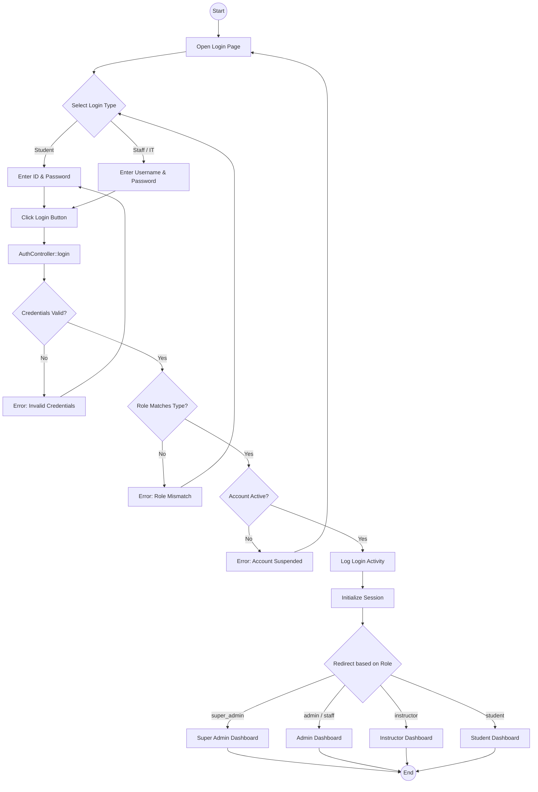

# EDU Nexus Login Flowchart

This flowchart illustrates the authentication and authorization process for the EDU Nexus platform.

```mermaid
graph TD
    %% Node Definitions
    Start((Start))
    OpenLogin[Open Login Page]
    SelectType{Select Login Type}
    InputStudent[Enter ID & Password]
    InputStaff[Enter Username & Password]
    Submit[Click Login Button]
    AuthCtrl[AuthController::login]
    AuthCreds{Credentials Valid?}
    ErrCreds[Error: Invalid Credentials]
    ErrRole[Error: Role Mismatch]
    ErrStatus[Error: Account Suspended]
    CheckRole{Role Matches Type?}
    CheckStatus{Account Active?}
    AuditLog[Log Login Activity]
    CreateSession[Initialize Session]
    Redirect{Redirect based on Role}
    SADash[Super Admin Dashboard]
    ADash[Admin Dashboard]
    IDash[Instructor Dashboard]
    SDash[Student Dashboard]
    EndNode((End))

    %% Connections
    Start --> OpenLogin
    OpenLogin --> SelectType
    
    SelectType -- Student --> InputStudent
    SelectType -- "Staff / IT" --> InputStaff
    
    InputStudent --> Submit
    InputStaff --> Submit
    
    Submit --> AuthCtrl
    AuthCtrl --> AuthCreds
    
    AuthCreds -- No --> ErrCreds
    AuthCreds -- Yes --> CheckRole
    
    CheckRole -- No --> ErrRole
    CheckRole -- Yes --> CheckStatus
    
    CheckStatus -- No --> ErrStatus
    CheckStatus -- Yes --> AuditLog
    
    AuditLog --> CreateSession
    CreateSession --> Redirect
    
    Redirect -- super_admin --> SADash
    Redirect -- "admin / staff" --> ADash
    Redirect -- instructor --> IDash
    Redirect -- student --> SDash
    
    ErrCreds --> InputStudent
    ErrRole --> SelectType
    ErrStatus --> OpenLogin
    
    SADash --> EndNode
    ADash --> EndNode
    IDash --> EndNode
    SDash --> EndNode
```
